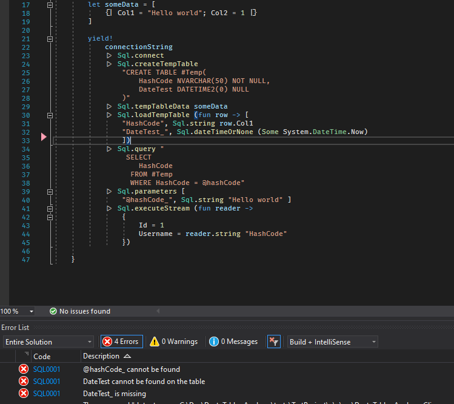

# DustyTables.Analyzer

Very early development

This is mash up of:

* https://github.com/Zaid-Ajaj/DustyTables
* https://github.com/Zaid-Ajaj/Npgsql.FSharp.Analyzer
* https://fsprojects.github.io/FSharp.Data.SqlClient/

They have done all the hard work I’ve just plucked the bit’s I needed to get this working.

